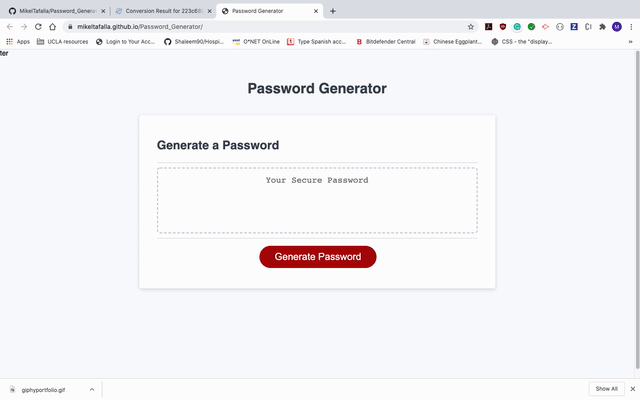

# Password_Generator

## Link
[Live Site](https://mikeltafalla.github.io/Password_Generator/)

## Table of Contents

* [Summary](#summary)
* [Technologies Used](#technologies_used)
* [Features](#features)
* [Instructions](#instructions)
* [Example Gif](#example-gif)
* [Author](#author)

### Summary

App that will assist you or your company creating secure passwords that will satisfy your requirements.

### Technologies Used

1. Javascript
2. HTML
2. CSS

### Features 

1. Generate Password button
2. Alert with instructions
3. Prompt to collect user's preferences
    * Option of Uppercase and Lowercase letters
    * Option of numbers
    * Option of symbols
    * Option of Password length (measures in characters)
    * assword is given in a text area

### Instructions:

1. Click the Password Generate button to start the prompts
2. Introduce all your preferences
    * You should answer as instructed in the prompts
    * If answer is not recognized you'll be prompted to input it again
3. Random Password will be displayed in the text area for user to copy and use.

## Example Gif

## Author 

**MikelTafalla**

Email: mikel362d@gmail.com

Location: Santa Barbara

GitHub: https://github.com/MikelTafalla

